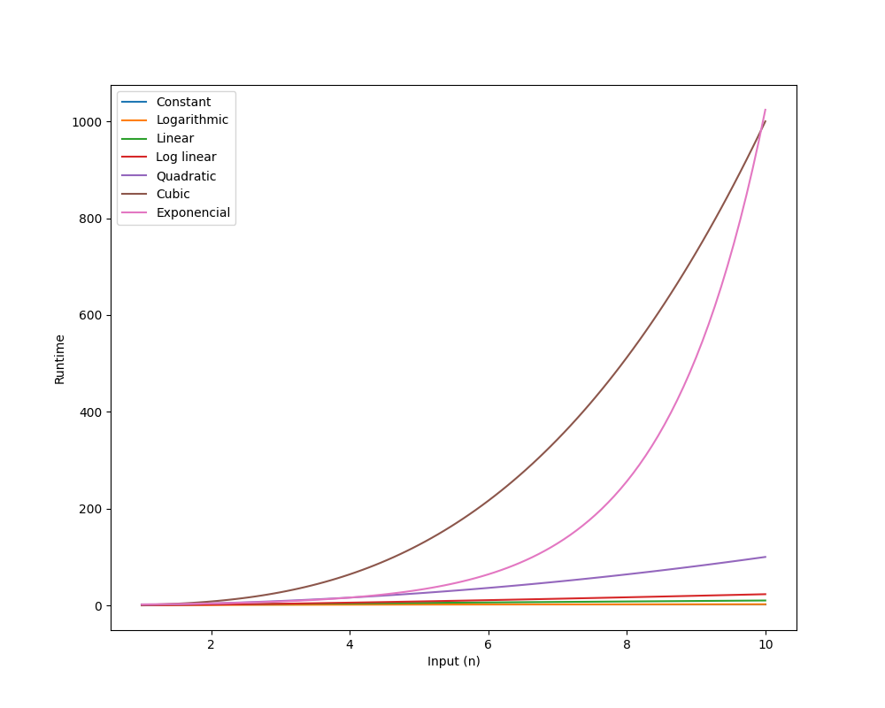

# Python Big O Complexity

A python script using pyplot (matlab like) lib to demonstrate big-o complexities of common algorithms.
Big O notation is used to classify algorithms based on their time and space complexity.


### Requirements
- matplotlib
- pyqt5 (lib GUI)

```sh
pip install matplotlib
pip install pyqt5
```


